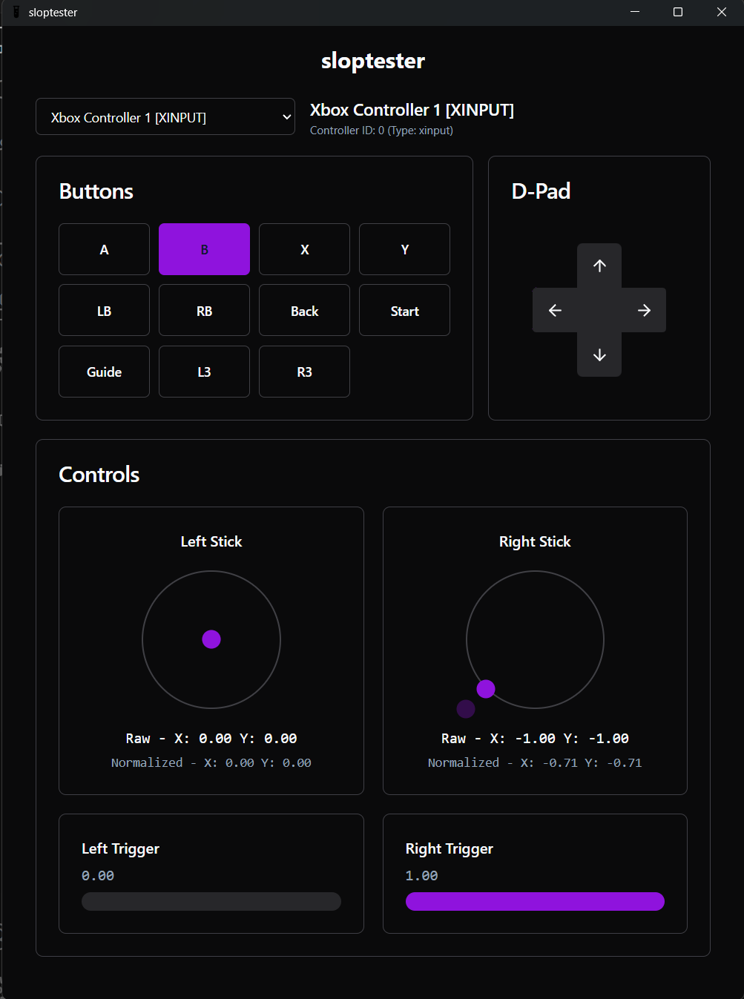

# sloptester



A modern, cross-platform gamepad testing application built with Tauri and Vue.js. Perfect for testing your GP2040-CE or Haybox controller.

## Features

- Real-time gamepad input visualization
- Analog stick position display
- Button state tracking
- D-pad input display
- Trigger sensitivity testing
- Support for multiple connected controllers

## Supported Controllers

This application is specifically designed to work with:
- GP2040-CE based controllers
- Haybox controllers
- Other SDL2/XInput gamepads

## Development

This project uses:
- Tauri
- Vue 3 with TypeScript
- Vite

### Setup Development Environment

```bash
# Install dependencies
pnpm install

# Start development server
pnpm tauri dev

# Build for production
pnpm tauri build
```

## Contributing

Contributions are welcome! Please feel free to submit a Pull Request.

## License

[MIT License](LICENSE)
